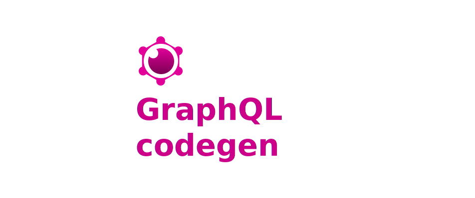

# insomnia-plugin-graphql-codegen

 

Automatically generate and import GraphQL operations to your Insomnia Workspace!

## Installation

- Open [Insomnia](https://insomnia.rest/) > Preferences > Plugins
- Type `insomnia-plugin-graphql-codegen` and install the plugin.

## How it works

- Open a workspace and select the workspace actions dropdown.
- Chose to either import from a url or a schema file.
- Your workspace now includes auto-generated GraphQL operations!

### Import from a File

### Import from a Url

TODO:
- [ ] Tests
- [ ] Re-importing operations will produce duplicates. 

## Contributing
Found any bugs? Have any more ideas or want to contribute to the existing development?
Feel free to create a PR/issue in the github repo!
