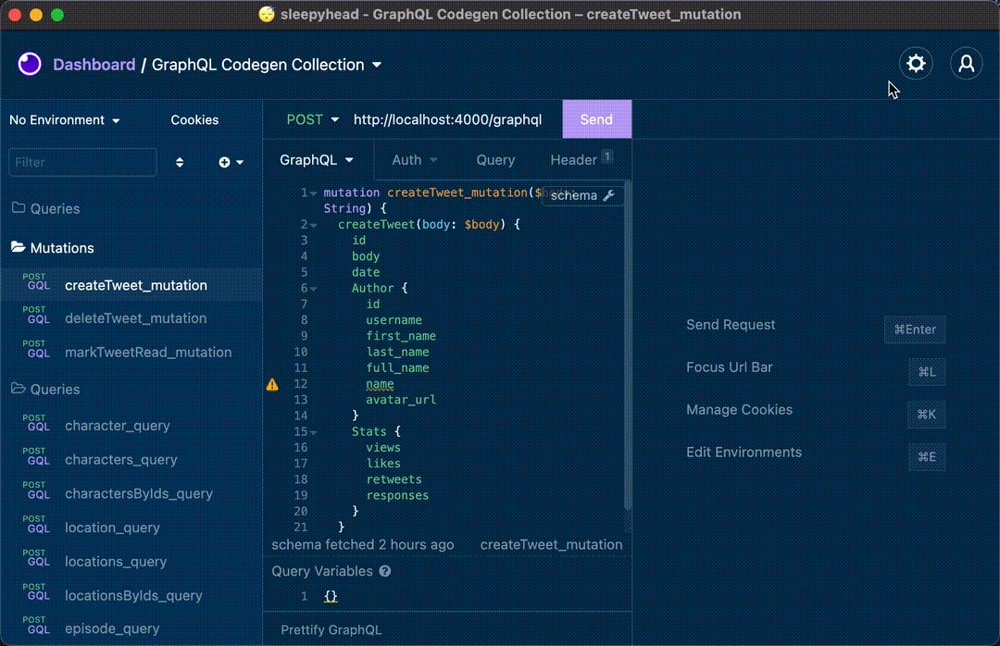
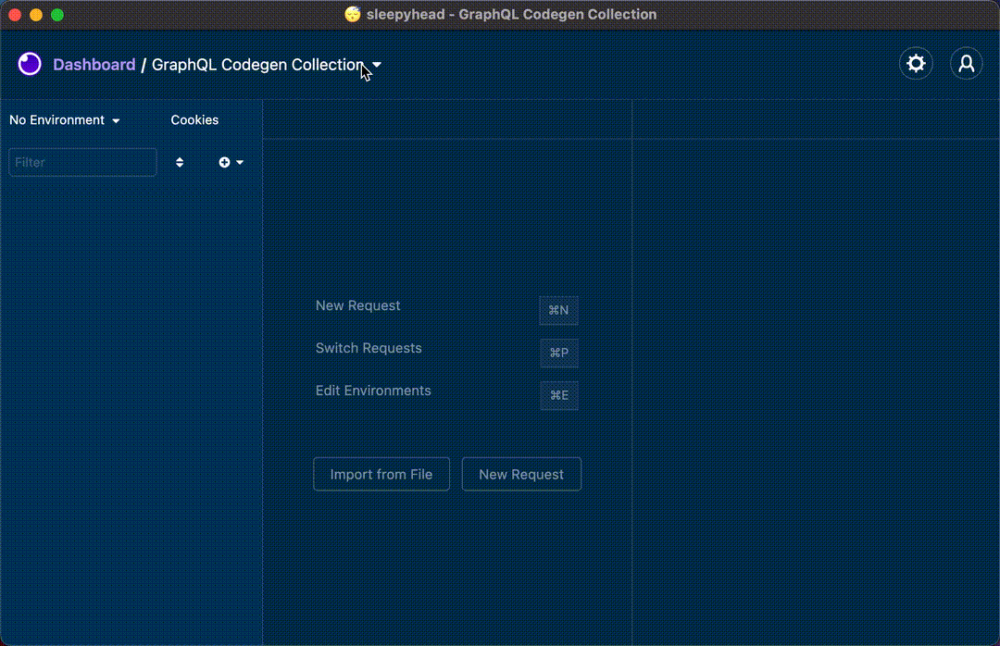

# insomnia-plugin-graphql-codegen

 

> This is a fork from [gatzjames/insomnia-plugin-graphql-codegen-import](https://github.com/gatzjames/insomnia-plugin-graphql-codegen-import)

## Fixed

- Fix localhost. eg: [http://localhost:3000/graphql](http://localhost:3000/graphql)
- Remove default url
- Rename from `operation_{mutation,query}` -> `operation`
- Fix duplicated after re-import

Automatically generate and import GraphQL operations to your Insomnia Workspace!

## Installation

- Open [Insomnia](https://insomnia.rest/) > Preferences > Plugins
- Type `insomnia-plugin-graphql-codegen-fixed` and install the plugin.

## How it works

- Open a workspace and select the workspace actions dropdown.
- Chose to either import from a url or a schema file.
- Your workspace now includes auto-generated GraphQL operations!

### Import from a File

### Import from a Url

TODO:
- [ ] Tests
- [x] Re-importing operations will produce duplicates. 

## Contributing
Found any bugs? Have any more ideas or want to contribute to the existing development?
Feel free to create a PR/issue in the github repo!
